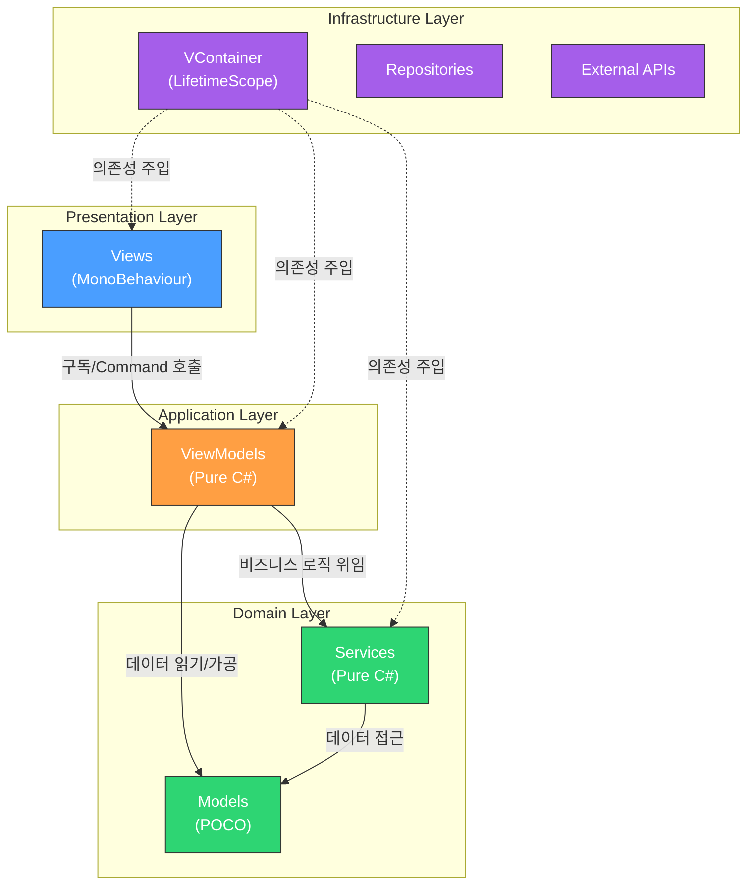
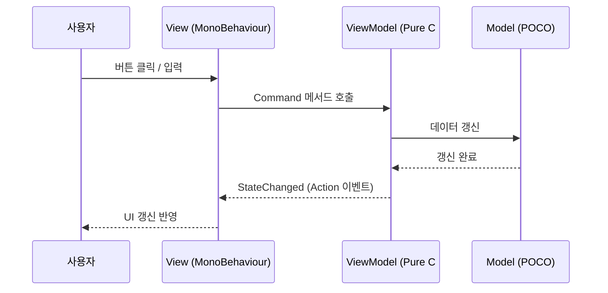
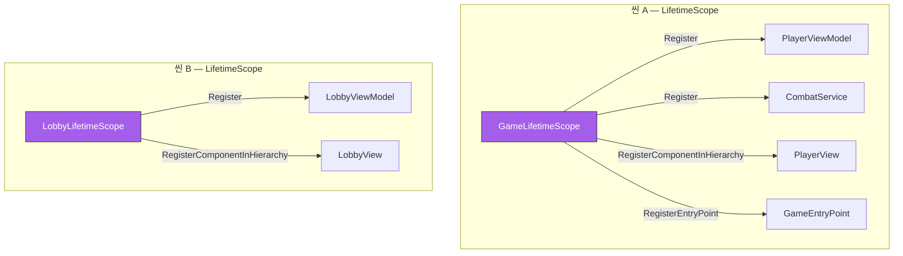
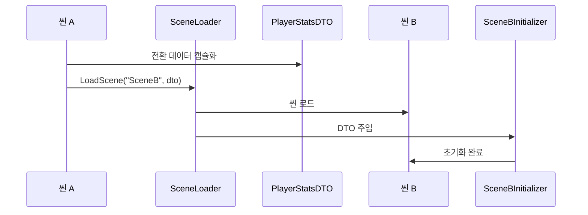

# 프로젝트 아키텍처 맵

> 이 문서는 프로젝트의 **전체 구조**를 시각적으로 파악하기 위한 아키텍처 레퍼런스입니다.
> 에이전트는 `AGENTS.md` 이후 두 번째로 이 문서를 참조합니다.

---

## 1. 레이어 아키텍처

프로젝트는 4개의 수평 레이어로 구성되며, **상위 → 하위 방향**으로만 참조할 수 있습니다.



### 의존성 규칙 (절대 준수)

| 규칙 | 설명 |
|------|------|
| ✅ View → ViewModel | View는 ViewModel의 상태 구독 및 Command 호출만 가능 |
| ✅ ViewModel → Model/Service | ViewModel은 Model 데이터를 읽고 가공 |
| ✅ Service → Model | Service는 Model 데이터를 조작 |
| ❌ View → Model | **절대 금지** — 모든 데이터는 ViewModel을 경유 |
| ❌ Model → ViewModel | 역방향 참조 금지 |
| ❌ Model → View | 역방향 참조 금지 |

---

## 2. 네임스페이스 맵

```
[프로젝트명]
├── [프로젝트명].Core                 ← DI 설정, 이벤트 버스, 씬 관리
│   ├── DI/                          ← LifetimeScope 구성
│   ├── Events/                      ← 이벤트 정의
│   └── SceneManagement/             ← 씬 로더, 컨텍스트 매니저
├── [프로젝트명].Models               ← 순수 데이터 클래스 (POCO)
│   ├── Player/                      ← 플레이어 관련 모델
│   ├── Inventory/                   ← 인벤토리 관련 모델
│   └── Common/                      ← 공통 모델
├── [프로젝트명].ViewModels           ← UI 상태 가공, Command 제공
│   ├── Player/
│   ├── Inventory/
│   └── Common/
├── [프로젝트명].Views                ← MonoBehaviour (바인딩 + 입력 전달)
│   ├── Player/
│   ├── Inventory/
│   └── Common/
├── [프로젝트명].Services             ← 비즈니스 로직 서비스
│   ├── Combat/
│   ├── Economy/
│   └── Persistence/
├── [프로젝트명].DTOs                 ← 데이터 전송 객체
│   └── SceneTransition/             ← 씬 전환용 DTO
└── [프로젝트명].Utilities            ← 확장 메서드, 헬퍼
    ├── Extensions/
    └── Helpers/
```

---

## 3. MVVM 데이터 흐름



### 단방향 데이터 흐름 요약

```
[사용자 입력] → View → ViewModel.Command() → Model 갱신
                                               ↓
[UI 갱신]    ← View ← ViewModel.StateChanged ←
```

> **핵심**: View는 절대로 Model을 직접 참조하지 않습니다. 모든 데이터 교환은 ViewModel을 통해서만 이루어집니다.

---

## 4. VContainer DI 구조



### LifetimeScope 구성 패턴

```csharp
public class GameLifetimeScope : LifetimeScope
{
    protected override void Configure(IContainerBuilder builder)
    {
        ConfigureModels(builder);
        ConfigureViewModels(builder);
        ConfigureViews(builder);
        ConfigureServices(builder);
        ConfigureEntryPoints(builder);
    }

    private void ConfigureModels(IContainerBuilder builder) { /* ... */ }
    private void ConfigureViewModels(IContainerBuilder builder) { /* ... */ }
    private void ConfigureViews(IContainerBuilder builder) { /* ... */ }
    private void ConfigureServices(IContainerBuilder builder) { /* ... */ }
    private void ConfigureEntryPoints(IContainerBuilder builder) { /* ... */ }
}
```

### 등록 규칙

| 대상 | 등록 방식 | 예시 |
|------|----------|------|
| View (MonoBehaviour) | `RegisterComponentInHierarchy<T>()` | 씬 하이어라키에서 자동 탐색 |
| ViewModel (Pure C#) | `Register<T>(Lifetime)` | `.AsImplementedInterfaces()` 체이닝 |
| Service (Pure C#) | `Register<T>(Lifetime)` | `.As<IService>()` 인터페이스 바인딩 |
| EntryPoint | `RegisterEntryPoint<T>()` | `IStartable`, `ITickable` 구현 클래스 |
| 동적 생성 View | `RegisterComponentOnNewGameObject<T>()` | 런타임 동적 생성 시에만 |

> ⚠️ **금지**: LifetimeScope에서 `[SerializeField]`로 뷰 컴포넌트를 직접 참조하여 `RegisterInstance`로 등록하는 방식

---

## 5. 씬 전환 및 DTO 흐름



### DTO 규칙

- DTO는 **순수 데이터 클래스** (POCO)
- `~DTO` 접미사 필수 (예: `PlayerStatsDTO`)
- 전역 의존성(싱글톤, static) 절대 배제
- 씬 로더 또는 컨텍스트 매니저를 통해 다음 씬의 Initializer에 직접 주입

---

## 6. 디자인 패턴 매핑

### 프로젝트에서 사용하는 패턴

| 카테고리 | 패턴 | 적용 영역 | 예시 |
|----------|------|----------|------|
| **생성** | Factory Method | 객체 생성 로직 분리 | `EnemyFactory.Create(type)` |
| **생성** | Object Pool | 빈번한 생성/파괴 최적화 | 투사체, 이펙트 풀링 |
| **생성** | Builder | 복잡한 객체 조립 | 캐릭터 빌더 |
| **구조** | Facade | 서브시스템 통합 인터페이스 | `AudioFacade` |
| **구조** | Flyweight | 공유 데이터 | ScriptableObject 기반 |
| **구조** | Decorator | 기능 동적 추가 | 버프/디버프 시스템 |
| **구조** | Adapter | 인터페이스 변환 | 서드파티 래퍼 |
| **행동** | State/FSM | 상태 제어 | 캐릭터 상태 머신 |
| **행동** | Strategy | 런타임 알고리즘 교체 | AI 행동 전략 |
| **행동** | Observer | 이벤트 기반 통신 | `Action`, `UnityAction` |
| **행동** | Command | 명령 캡슐화 | Undo/Redo 시스템 |
| **행동** | Behavior Tree | AI 의사결정 | NPC AI |

### 절대 사용하지 않는 패턴

| 패턴 | 이유 |
|------|------|
| ❌ Singleton | 전역 상태 오염, 테스트 불가, 의존성 숨김 → VContainer DI로 대체 |

---

## 7. 폴더 구조 상세

```
Assets/
├── Scripts/
│   ├── Core/
│   │   ├── DI/                      ← LifetimeScope 구성 클래스
│   │   ├── Events/                  ← 이벤트 정의 (Action 기반)
│   │   └── SceneManagement/         ← 씬 로더, 컨텍스트 매니저
│   ├── Models/                      ← 순수 데이터 클래스 (POCO)
│   ├── ViewModels/                  ← UI 상태 가공, Command
│   ├── Views/                       ← MonoBehaviour (바인딩만)
│   ├── Services/                    ← 비즈니스 로직
│   ├── DTOs/                        ← 데이터 전송 객체
│   ├── Interfaces/                  ← 공유 인터페이스 정의
│   └── Utilities/                   ← 확장 메서드, 헬퍼
├── Scenes/
│   ├── Main/                        ← 메인 씬
│   └── UI/                          ← UI 전용 씬
├── Prefabs/
│   ├── UI/                          ← UI 프리팹
│   └── Gameplay/                    ← 게임플레이 프리팹
├── ScriptableObjects/
│   ├── Data/                        ← 게임 데이터 SO
│   └── Config/                      ← 설정 SO
├── Art/
│   ├── Materials/
│   ├── Textures/
│   └── Models/
└── Plugins/                         ← 서드파티 (수정 금지)
```
