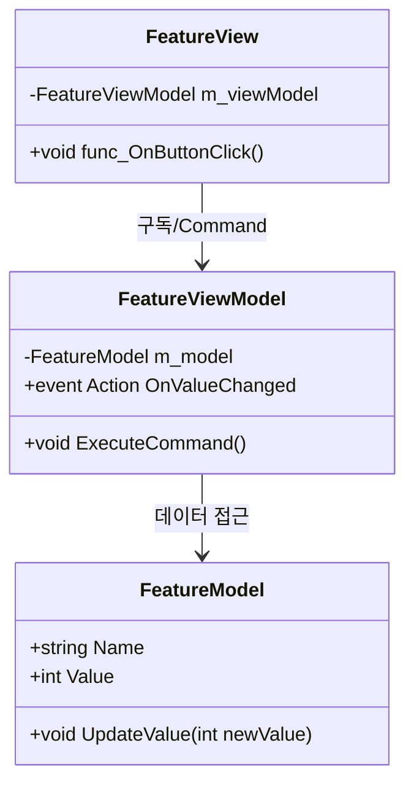

# [기능명] 설계 문서

> 파일명 규칙: `YYYY-MM-DD-기능명-design.md`
> 이 템플릿을 복사하여 새 설계 문서를 작성하십시오.

---

## 개요

- **기능명**: [기능명]
- **작성자**: [작성자]
- **작성일**: YYYY-MM-DD
- **상태**: 📝 작성 중 / 🔍 리뷰 중 / ✅ 승인됨

### 배경

[이 기능이 필요한 이유와 배경을 기술합니다.]

### 목표

[이 기능이 달성해야 할 구체적인 목표를 기술합니다.]

---

## 요구사항

### 기능 요구사항

| ID | 요구사항 | 우선순위 |
|----|---------|---------|
| FR-001 | [요구사항 설명] | 필수 |
| FR-002 | [요구사항 설명] | 선택 |

### 비기능 요구사항

| ID | 요구사항 | 기준 |
|----|---------|------|
| NFR-001 | 성능 | [구체적 수치 목표] |
| NFR-002 | 메모리 | [구체적 수치 목표] |

---

## 아키텍처 설계

### 레이어 배치

[이 기능의 클래스들이 어느 레이어에 배치되는지 명시합니다.]

| 레이어 | 클래스 | 역할 |
|--------|--------|------|
| Presentation (View) | `[ClassName]View` | UI 바인딩 |
| Application (ViewModel) | `[ClassName]ViewModel` | 상태 가공 |
| Domain (Model) | `[ClassName]Model` | 데이터 및 규칙 |
| Domain (Service) | `[ClassName]Service` | 비즈니스 로직 |

### 데이터 흐름 (MVVM)

```
[사용자 입력] → View → ViewModel.Command() → Model/Service 갱신
                                                ↓
[UI 갱신]    ← View ← ViewModel.StateChanged ←
```

[구체적인 데이터 흐름을 다이어그램으로 기술합니다.]

### 클래스 다이어그램



### 의존성 주입 설정 (VContainer)

```csharp
private void ConfigureFeature(IContainerBuilder builder)
{
    builder.Register<FeatureModel>(Lifetime.Singleton);
    builder.Register<FeatureViewModel>(Lifetime.Singleton);
    builder.RegisterComponentInHierarchy<FeatureView>();
}
```

---

## 디자인 패턴 적용

| 패턴 | 적용 위치 | 이유 |
|------|----------|------|
| [패턴명] | [클래스/모듈] | [적용 이유] |

---

## 에러 처리

| 시나리오 | 처리 방법 |
|---------|----------|
| [에러 시나리오] | [처리 방법] |

---

## 테스트 계획

### 단위 테스트

| 테스트 | 대상 | 기대 결과 |
|--------|------|----------|
| [테스트명] | [대상 메서드] | [기대 결과] |

### 통합 테스트

| 테스트 | 시나리오 | 기대 결과 |
|--------|---------|----------|
| [테스트명] | [시나리오] | [기대 결과] |

---

## Open Questions

- [ ] [해결되지 않은 질문 1]
- [ ] [해결되지 않은 질문 2]

---

## 변경 이력

| 날짜 | 작성자 | 변경 내용 |
|------|--------|----------|
| YYYY-MM-DD | [작성자] | 초안 작성 |
