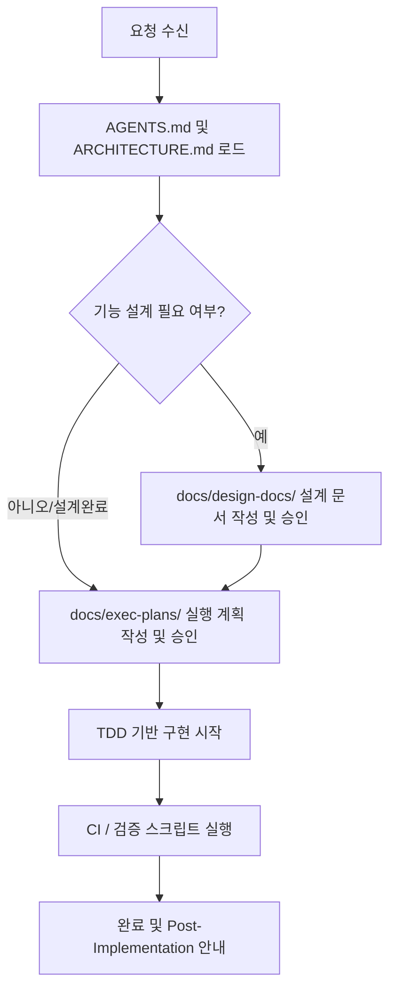

# AI 에이전트 온보딩 가이드 (Agent Quickstart)

> 이 문서는 이 프로젝트에 새로 참여한 **AI 코딩 에이전트**를 위한 온보딩 가이드입니다.
> 에이전트는 작업을 시작하기 전에 이 가이드를 숙지해야 합니다.

---

## 1. 에이전트 작업 프로세스

이 레포지토리에서는 AI 에이전트의 오작동 및 코드 퀄리티 저하를 막기 위해 다음과 같은 엄격한 프로세스를 따릅니다.

### 필수 확인 사항
1. **문맥 파악**: 작업을 위임받으면 절대로 임의로 소스 코드를 수정하지 마십시오. 먼저 `AGENTS.md`와 `ARCHITECTURE.md`를 확인한 뒤, 변경이 필요한 컴포넌트의 표준 문서를 점진적으로 로드하여 분석하십시오.
2. **구현 승인**: 에이전트는 계획(설계 또는 실행 계획)에 대해 사용자의 명시적인 승인 텍스트("진행", "승인", "구현 시작" 등)를 받기 전에는 어떠한 소스 코드도 변경하거나 새로 작성할 수 없습니다.

---

## 2. 문서 및 변경 관리 규칙

### 제품 스펙 (What)
- 기획서 및 변경 명세는 `docs/product-specs/` 폴더에 위치합니다.
- 기획 상의 변경이 발생할 때 최우선적으로 참조하는 원천 소스입니다.

### 설계 문서 (How)
- 구조적 변경이 수반되는 작업은 반드시 `docs/design-docs/` 아래에 설계를 먼저 작성해야 합니다.
- MVVM 관계, VContainer 의존성, 디자인 패턴 적용 방식이 여기에 서술됩니다.

### 실행 계획 (Actionable Steps)
- 구현 단위의 상세 가이드는 `docs/exec-plans/active/` 내에 개별 마크다운 파일로 작성합니다.
- 이 계획서는 TDD 방식에 따라 하나의 검증 가능한 단계마다 체크박스(`- [ ]`)가 설정되어야 합니다.

---

## 3. 코드 퀄리티 및 아키텍처 제약 (Strict)

### MVVM 경계 준수
- **View는 Model을 알 수 없습니다.** View는 오직 ViewModel만을 참조해야 합니다.
- **Model은 POCO로 작성합니다.** Unity API(`MonoBehaviour` 등)에 의존하지 않는 순수 C# 도메인 모델이어야 합니다.
- **단방향 데이터 흐름**: View가 사용자 입력을 받아 ViewModel의 Command 메서드를 실행하면, ViewModel이 Model을 갱신하고, 변경 이벤트를 발행하여 View가 이를 구독하고 화면을 갱신합니다.

### 널 안정성 (Fake Null)
- `UnityEngine.Object` 파생 타입(GameObject, Component)에는 `?.` 또는 `??` 연산자를 **절대 사용하지 마십시오.**
- 반드시 `if (obj != null)` 형태로 명시적인 null 체크를 수행해야 합니다.

### Zero Alloc (성능)
- `Update`, `FixedUpdate`, `LateUpdate` 등 프레임마다 주기적으로 호출되는 메서드 영역 내부에서는 `new` 키워드, Boxing, LINQ 구문을 사용할 수 없습니다.

---

## 4. 구현 완료 후 제출물 체크리스트
작업이 완료되면 사용자에게 다음 사항을 빠짐없이 문서화하여 안내해야 합니다.

1. **에디터 참조 필요 버튼 목록**: `func_` 접두사가 포함되어 Unity Inspector상에서 버튼의 `OnClick` 등에 직접 매핑해야 하는 메서드 정보.
2. **SerializeField 참조 목록**: 컴포넌트나 프리팹 등에 새로 추가된 `[SerializeField]` 필드에 대한 할당 안내.
3. **이벤트 구독 해제 여부**: 메모리 누수를 감지하고 방지하기 위해 생성/소멸 시점에서 정상적으로 구독 및 구독 해제가 이루어지는지 검증한 내역.
