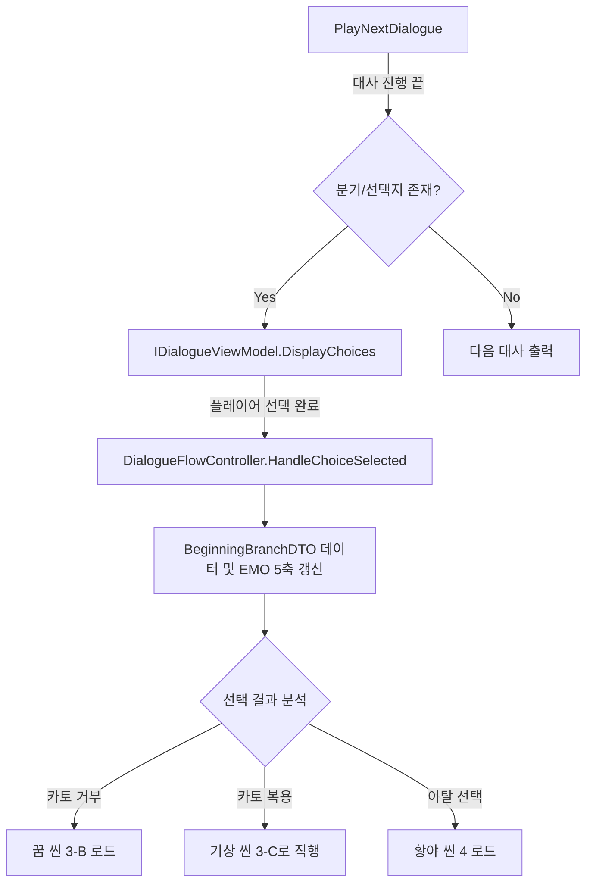

# NULLOVE - 기(起) 씬 1~3 선택지 및 스토리 분기 상세 설계서

본 문서는 **NULLOVE**의 도입부인 기(起)의 씬 1~3 시나리오 연출 노트와 선택지 분기 시스템의 데이터 흐름, 그리고 아키텍처 설계를 기술합니다. 본 설계는 인게임 대화 제어 시스템 및 데이터 지속성 모듈의 구현 기준이 됩니다.

---

## 1. 개요 및 설계 방향성

- **자유의지의 부재에서 이탈로의 전개**: 주인공이 규격화되고 통제된 세계(씬 1)에서 첫 이질감(씬 2)을 겪고, 스스로의 선택을 통해 이탈(씬 3)하는 흐름을 시스템적 수치와 상태 변화로 치환합니다.
- **감정 및 자원 변동 누적**: 1회차 도입부에서는 감정 UI가 잠겨 있지만, 플레이어의 선택(고개 끄덕임, 짚 인형 획득, 카토 거부 등)에 따른 감정 상태 및 인벤토리 DTO는 백그라운드에서 실시간으로 누적 및 기록됩니다.
- **선택의 나비효과**: 도입부의 사소한 선택(짚 인형 획득 여부)이 후반부(씬 11 카토 공장, 씬 13 대면 등)의 서브플롯 해금 및 진엔딩 판정의 핵심 트리거로 작동하도록 설계합니다.

---

## 2. 선택지 및 스토리 분기 매트릭스 (씬 1~3)

### 2.1. [씬 2-C] 노인과의 눈맞춤 (시선 교환)
- **선택지 메뉴**:
  - **A. 시선을 피한다**: 
    - 효과: 감정 변동 없음. 주머니에서 카토를 꺼내 만지작거리는 연출 출력.
    - 독백 텍스트: *"...아무것도 아니야."*
  - **B. 고개를 끄덕인다**:
    - 효과: `Curiosity` (호기심) +1, `Confusion` (혼란) +1. 노인의 미소에 경직되는 연출.
    - 독백 텍스트: *"...이건 뭐지."*
- **나비효과**: B를 선택한 경우, [씬 3-B] 첫 꿈 시퀀스에서 추가 대사 및 연출의 선명도가 상승함.

### 2.2. [씬 2-D] 이동 수단 고장 (짚 인형 획득)
- **선택지 메뉴**:
  - **A. 받는다**:
    - 효과: 인벤토리 DTO에 아이템 `ITEM_STRAW_DOLL` (짚 인형) 추가. `Curiosity` +1.
    - 연동 데이터: 유진 서브플롯(`SUB_YUJIN`) 진행도 해금 및 노인 정체 플래그 누적 시작.
  - **B. 뒤로 물러난다**:
    - 효과: 아무 획득 없음. 노인이 인형을 거두는 연출 출력.
- **나비효과**: 짚 인형 소지 시, 후반부 카토 공장 및 최종 대면(CONF)에서의 카드 활성화 조건에 지대한 영향을 미침.

### 2.3. [씬 3-A] 밤, 기숙사 (첫 카토 복용 선택)
- **선택지 메뉴**:
  - **A. 카토를 먹는다**:
    - 효과: 카토 재고 `-1`. 전체 감정 수치 감쇄.
    - 흐름: 꿈 시퀀스([씬 3-B])를 스킵하고 즉시 다음 날 아침([씬 3-C])으로 진행. 등굣길 이탈 시점에서 약효로 인한 저항 연출 추가.
  - **B. 카토를 내려놓는다**:
    - 효과: 카토 재고 변동 없음 (주머니 누적). 감시도(`Surveillance`) +1, 회차 인식도 경험치 누적.
    - 흐름: 따뜻한 주황빛 무의식 꿈 시퀀스([씬 3-B]) 강제 진입.

### 2.4. [씬 3-D] 등굣길 (최초의 세계관 이탈)
- **선택지 메뉴**:
  - **A. 학교로 간다**:
    - 효과: 일시적 순응. 당일 일과가 반복 진행되며 밤에 다시 B코스 선택으로 강제 회귀 (루프 지연 연출).
  - **B. 야만인 구역으로 간다**:
    - 효과: 궤도 이탈 확정. `Fear` (공포) +2, `Confusion` (혼란) +1.
    - 흐름: 기(起) 장을 마감하고 야만인 구역 진입 씬([SC_04])으로 씬 라우팅 개시.

---

## 3. 분기 흐름 시스템 아키텍처 (System Architecture)

### 3.1. 분기 데이터 모델 (Domain DTO)

선택의 결과와 씬의 흐름 상태는 `SaveDataFileDTO` 내의 세션 데이터로 보존됩니다.

```csharp
namespace Domain.InGame
{
    [System.Serializable]
    public class BeginningBranchDTO
    {
        public bool EyeContactAcknowledged;   // 노인과 눈맞춤 시 고개를 끄덕였는가 (B선택 여부)
        public bool HasStrawDoll;              // 짚 인형을 획득했는가
        public int CatoStocks;                 // 보유 중인 카토 알약 수 (시작 시 2)
        public bool CatoRefusedAtFirstNight;   // 첫날 밤 카토를 거부했는가
        public bool EscapedToWilderness;       // 학교를 이탈해 황야로 향했는가
    }
}
```

### 3.2. 씬 제어 및 분기 라우팅 매니저 (DialogueFlowController 확장)

선택지가 입력되었을 때 세션 데이터 DTO를 갱신하고 스토리 경로를 분기시키는 엔트리 포인트를 다음과 같이 설계합니다.



### 3.3. UI 색조 변환 시스템 (Camera Color Tint Controller)
- **개념**: [씬 2-C]의 선택(고개 끄덕임)이나 [씬 3-C]의 기상 시점에 전체 화면의 색조(Color Tint)가 따뜻하게 시프트되는 효과를 담당하는 컴포넌트입니다.
- **구조**:
  - `ISceneInfoViewModel`의 이벤트를 구독하여 `SceneInfoDTO`가 갱신되거나 감정 상태 변동 시 카메라 필터 또는 포스트 프로세싱 볼륨 값을 부드럽게 조정(DOTween)합니다.

---

## 4. 플레이어 조작 피드백 및 예외 연출 설계

1. **동선 강제 연출 (씬 1-A, 1-D)**:
   - 플레이어가 정해진 이동 대열에서 벗어나려고 하거나 다른 곳을 클릭하면, 캐릭터가 원래 자리로 튕겨 들어옵니다.
   - 이때 시스템 알림 창에 `"갈 곳이 없다."`, `"빨리 걸을 이유가 없다."` 라는 시스템 메시지를 띄워 통제된 자유의지를 연출합니다.
2. **카토 인벤토리 동적 표시 (씬 1-B)**:
   - 배급원으로부터 약을 받는 시점에 화면 좌측 상단 HUD에 카토 수치(`[카토: 2/2]`)가 처음 페이드 인되며 활성화됩니다.
3. **침묵의 3초 연출 (씬 2-C)**:
   - 노인과 눈이 마주치는 장면에서는 모든 대사와 UI가 즉시 숨김 처리되고, 오직 바람 소리와 사각사각 거리는 짚 엮는 효과음만 강조하여 연출합니다.

---

## 5. 종합 감정 설계 및 검증 조건

- **감정 5축 누적 검사**:
  - 슬픔(Sorrow), 기쁨(Joy), 호기심(Curiosity), 공포(Fear), 혼란(Confusion) 수치는 잠금 상태여도 내부적으로 `ResourceDomainService`를 거쳐 정확히 가산되어야 합니다.
- **도감 해금 연동**:
  - 짚 인형을 획득하고 이탈에 성공하여 씬 3을 마칠 경우, 글로벌 DTO의 `UnlockedClues` 리스트에 `CLUE_STRAW_DOLL` 코드가 즉시 추가되어 영구 저장됩니다.
